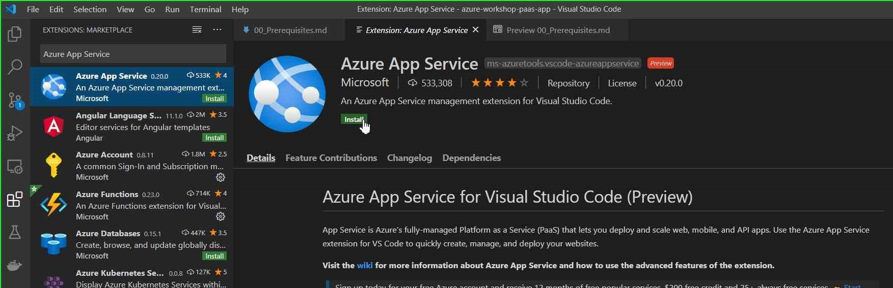

# Visual Studio Code
Install Visual Studio Code ([download here](https://code.visualstudio.com/download))

# Visual Studio Code - App Service Extension
Search "Azure App Service" in VS Code extensions and install

# git
Install git ([download here](https://git-scm.com/downloads))

# Node.js
Install Node.js ([download here](https://nodejs.org/en/download/))

# Azure Subscription
Azure subscription with at least contributor role assigned to the user at subscription or resource group level

# Azure Active Directory
Azure Active Directory
