# Create Node.js Web Application
ไปที่ Visual Studio Code เลือกเมนู File > Open Folder

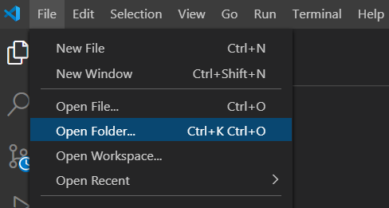

เลือก folder web ใน (workshop repository)/Files/01/web

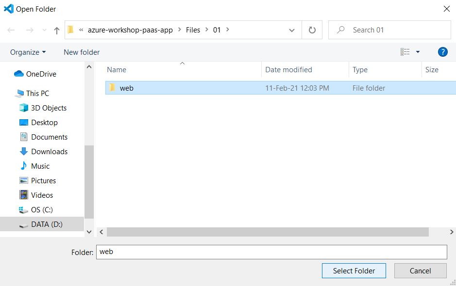

Source Code ของ web project จะถูกแสดงใน visual studio code

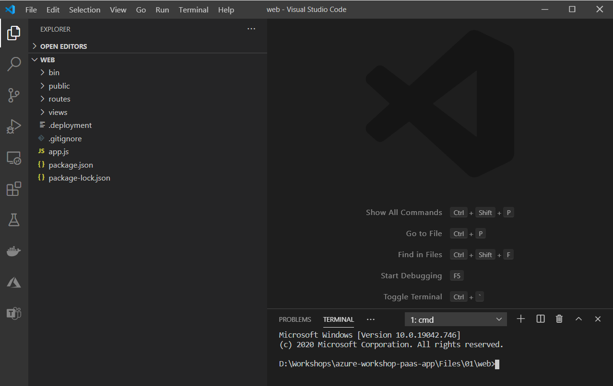

ไปที่ terminal รันคำสั่ง npm install เพื่อ restore packages

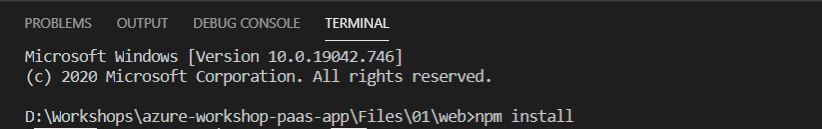

รันคำสั่ง npm start เพื่อรับ web project บนเครื่อง

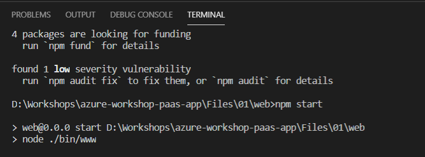

ทดลองเปิด browser ไปที่ http://localhost:3000 

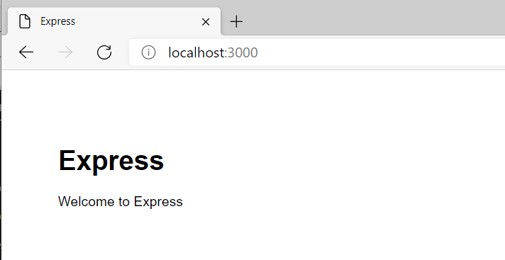

# Create App Service (Azure Portal)

ไปที่ Azuer Portal (https://portal.azure.com) login เพื่อเข้าใช้งาน

เลือกเมนูแฮมเบอเกอร์ทางซ้ายบน และเลือก Create Resource

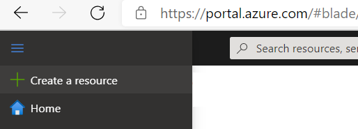

ที่ช่องค้นหา search คำว่า "App Service Plan"

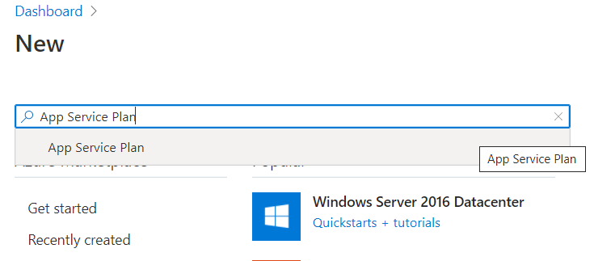

ที่หน้า product detail ของ app service plan กดปุ่ม "Create"

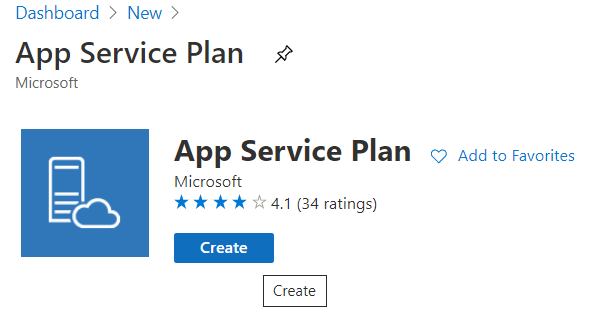

ทำการใส่ค่าดังนี้

| Subscription | (subscription ที่ใช้ทำ workshop) |
| Resource Group | (resource group ที่ได้รับ assign ไว้ทำ workshop) |
| Name | workshop_apps_plan |
| Operating System | Linux |
| Region | Southeast Asia |

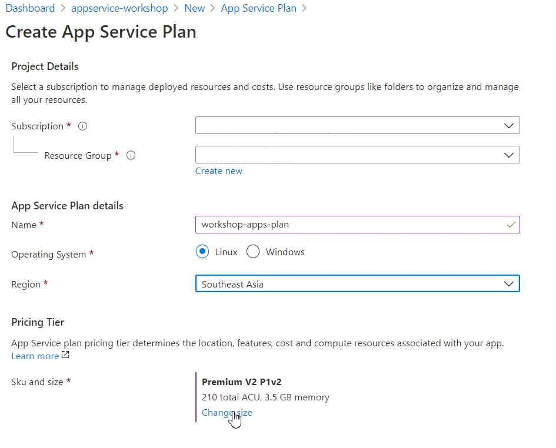

ที่ Pricing Tiers กด link "Change Size" เพื่อทำการเลือก Sizing ของ App Service Plan 

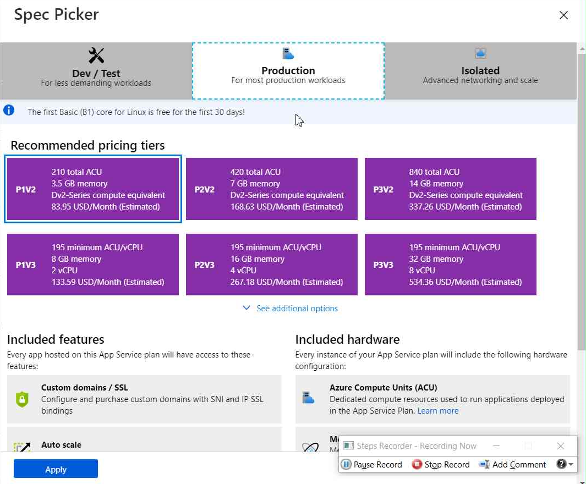

# Deploy Web Application to App Service

