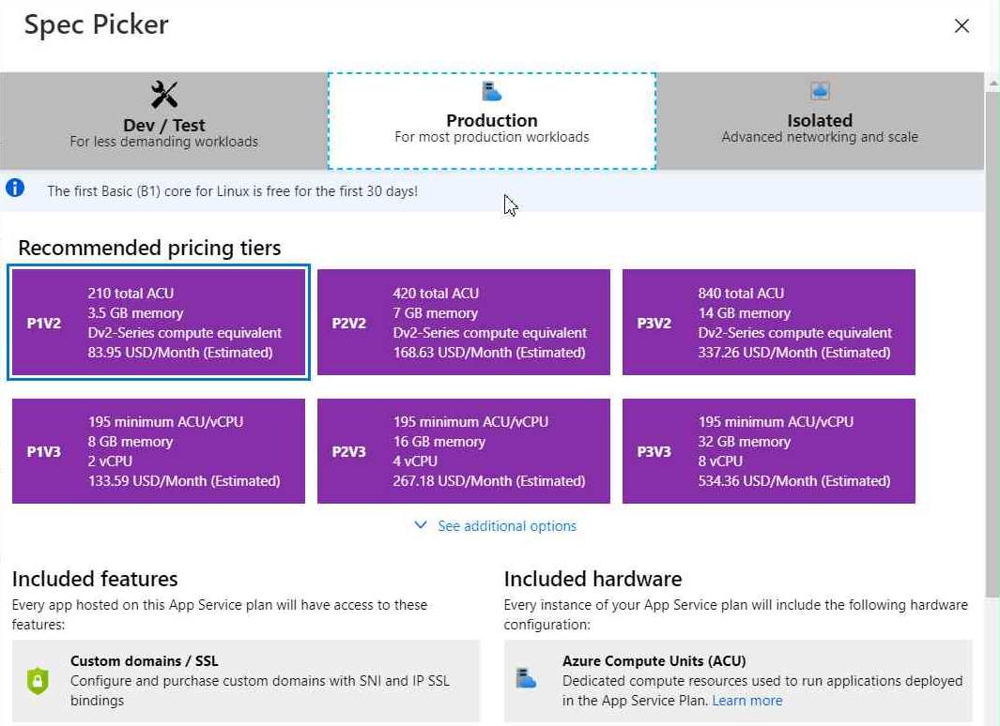

# Create Node.js Web Application
ไปที่ Visual Studio Code เลือกเมนู File > Open Folder

เลือก folder web ใน (workshop repository)/Files/01/web

Source Code ของ web project จะถูกแสดงใน visual studio code

ไปที่ terminal รันคำสั่ง npm install เพื่อ restore packages

รันคำสั่ง npm start เพื่อรับ web project บนเครื่อง

ทดลองเปิด browser ไปที่ http://localhost:3000 

# Create App Service Plan (Azure Portal)

ไปที่ Azuer Portal (https://portal.azure.com) login เพื่อเข้าใช้งาน

เลือกเมนูแฮมเบอเกอร์ทางซ้ายบน และเลือก Create Resource

ที่ช่องค้นหา search คำว่า "App Service Plan"

ที่หน้า product detail ของ app service plan กดปุ่ม "Create"

ทำการใส่ค่าดังนี้

| | |
|---|---|
| Subscription | (subscription ที่ใช้ทำ workshop) |
| Resource Group | (resource group ที่ได้รับ assign ไว้ทำ workshop) |
| Name | workshop_apps_plan |
| Operating System | Linux |
| Region | Southeast Asia |

ที่ Pricing Tiers กด link "Change Size" เพื่อทำการเลือก Sizing ของ App Service Plan 

# Create Web App

เลือกเมนูแฮมเบอเกอร์ทางซ้ายบน และเลือก Create Resource

ที่ช่องค้นหา search คำว่า "Web App" 

ที่หน้า product detail ของ Web App กดปุ่ม "Create"

ที่ **Basics** Tab ให้ทำการใส่ค่าดังนี้

| | |
|---|---|
| Subscription | (subscription ที่ใช้ทำ workshop) |
| Resource Group | (resource group ที่ได้รับ assign ไว้ทำ workshop) |
| Name | (ชื่อเวบ อาจจะใส่วันที่หรือชื่อปนไปเพื่อไม่ให้ซ้ำ) |
| Publish | Code |
| Runtime stack | Node 12 LTS |
| Operating System | Linux |
| Regtion | Southeast Asia |
| App Service Plan | (ให้ทำการเลือก Plan ที่สร้างไว้ก่อนหน้า) |

กดปุ่ม Review + create 

หลังจากผ่านการตรวจสอบว่าสามารถสร้าง resource ได้ ให้กดปุ่ม Create เพื่อยืนยันการสร้าง Web App

หลังจากสร้าง web app สำเร็จ ให้ทำการลองเปิด url ของ web app ตามที่ตั้งไว้ 

# Deploy Web Application to App Service

เปิดโปรแกรม Visual Studio Code ทำการเลือก **Azure** Tab แล้วเลือกไปที่ **APP SERVICE** 

หลังจากทำการ Login ตัว VS Code จะแสดงรายการ App Service ขึ้นมาให้ ให้เลือกไปที่ Web App ที่ทำการสร้างไว้ก่อนหน้านี้ click ขวาและเลือก **Deploy to Web App..**

vs code จะให้ทำการเลือก folder ที่จะทำการ deploy กด **Browse** menu

ทำการเลือก **web** folder ใน ที่อยู่ภายใต้ **(repo)/Files/01/** subfolder

vs code จะทำการสร้าง zip package และ deploy web application ไปยัง App Service 

# App Service Deployment Slots

ไปที่ตัว App Service ที่สร้างขึ้น ทำการเลือก **Deployment slots** Tab

หน้าจอจะแสดงรายการ slot ที่มีอยู่ ให้กดปุ่ม **Add Slot** เพื่อทำการสรา้ง slot ใหม่ 

ที่หน้าจอ Add Slot ให้ทำการตั้งชื่อ Slot ที่ถูกสร้างขึ้น และทำการเลือกว่าต้องการจะทำการ clone Application Configuration มาด้วยหรือไม่ เสร็จแล้วกดปุ่ม **Add**

หลังจากสร้าง slot ใหม่ขึ้นมาสำเร็จ ให้ลองทำการ แก้ไข Web แล้วลอง Deploy ไปที่ slot ที่สร้างขึ้น ทดลองทำการ Swap หรือ แบ่ง Traffic ดู 

