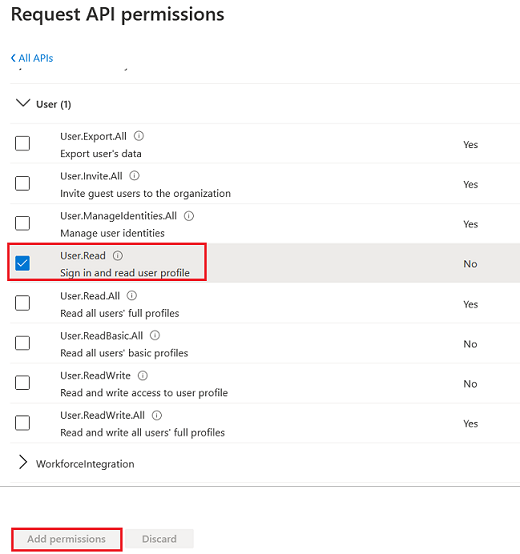

# Create Application Registration

ที่ใน Azure Portal ให้ทำการเลือก Tenant ให้ตรงตาม User Account ที่ใช้ 

ใน Azure Portal ที่เมนูหลักทางซ้ายมือ ให้เลือก Azure Active Directory

ไปที่ **App registrations** tab กดปุ่ม **New registration**

ที่หน้า Register an application ให้ทำการใส่ข้อมูลดังนี้ 

| | |
|---|---|
| Name | (ชือ application โดยอาจจะใช้เป็นชื่อเดียวกับ Web App ที่สร้างไว้ก่อนหน้า) |
| Supported account types | Accounts in this organizational directory only (... - Single tenant) |
| Redirect URI | เลือก Web ที่ Dropdownlist และระบุ url เป็น url ของ Web App เรา ตามด้วย **/.auth/login/aad/callback** เช่น https://workshopweb.azurewebsites.net/.auth/login/aad/callback |

เสร็จแล้วกดปุ่ม Register

หลังจาก App registration ได้ถูกสร้างขึ้นแล้ว ให้ไปที่ **Overview** tab ของ App registration ที่ถูกสร้างขึ้น และ บันทึกค่า **Application (client) ID**, **Directory (tenant) ID** เก็บไว้

# Configure App Service to use AAD Authentication

ไปที่ App Service ที่สร้างไว้ แล้วทำการเลือกไปที่ **Authentication / Authorization** Tab

ให้ระบุรายละเอียดดังนี้

| | |
|---|---|
| App Service Authentication | On |
| Action to take when request is not authenticated | Log in with Azure Active Directory |

และให้เลือกไปที่ตัวเลือก **Azure Active Directory** ภายใต้หัวข้อ Authentication Providers เพื่อกำหนดค่าเพิ่มเติม

ที่หน้า Azure Active Directory Settings ให้กำหนดค่าดังนี้ 

| | |
|---|---|
| Management mode | Advanced |
| Client ID | (ค่า **Application (client) ID** จาก App registration) |
| Issuer Url | ใส่ค่าเป็น https://login.microsoftonline.com/**Directory (tenant) ID**/v2.0 |

ทำการบันทึกค่า configuration แล้วให้ทำการทดสอบโดยการเข้า web อีกครั้งจาก in-private browser หรือ browser ยี่ห้ออื่นจากที่เปิดไว้ 

# Configure App Registration for Access Token

กลับไปที่ App registration ที่สร้างไว้ และทำการ configure ค่าเพิ่มเติมดังนี้ 

ไปที่ **Authentication** Tab ทำการเลือก **Access tokens** checkbox ภายใต้หัวข้อ implicit grant and hybrid flows

ไปที่ **Certificates & secrets** Tab ที่ภายใต้หัวข้อ Client secrets ให้ทำการสร้าง client secret ขึ้นมาแล้วเก็บค่า **Client Secret** ที่ทางระบบสุ่มขึ้นมาให้ไว้ใช้ภายหลัง 

ไปที่ **API permissions** Tab แล้วกดปุ่ม **Add a permission** 
หลังจากนั้น ทำการเลือก **Microsoft Graph** 

เลือกไปที่ **Delegated Permissions**

เลื่อนลงมาด้านล่าง ทำการเลือก **User.Read** permission แล้วกดปุ่ม Add permission เพื่อทำการบันทึกข้อมูล

เปิด browser tab ใหม่ ไปที่ https://resources.azure.com/
และให้ทำการเลือก dropdown ด้านบนสุดไปที่ Tenant ที่มี subscription ที่ App Service ใช้งานอยู่ 

ที่ Tree menu ทางด้านซ้าย ให้ expand ไปที่ 
subscriptions > (subscription ที่ใช้งานอยู่) > resourceGroups > (resource group ที่ใช้งานอยู่) > providers > Microsoft.Web > sites > (App Service) > config > authsettings

กดปุ่ม Edit ทางด้านบน และเลือกไปที่ปุ่ม Read/Write ด้านหลังชื่อ Tenant เพื่อเข้าสู่ edit mode

หา json field ที่ชื่อ **additionalLoginParams** และให้เพิ่มรายการ **"scope=openid User.Read"** เข้าไป

กดปุ่ม PUT ทางด้านบน เพื่อบันทึกข้อมูล

กลับไปที่ Active Directory Settings ของ App Service ให้นำค่า client secret ที่ได้มาก่อนหน้านี้ไปใส่ใน field **Client Secret (Optional)**

# Deploy Updated Web Application (Calling Microsoft Graph API)

ให้ทำการ deploy web application ไปที่ App Service โดยใช้ source จาก **web** folder ใน ที่อยู่ภายใต้ **(repo)/Files/02/** 
