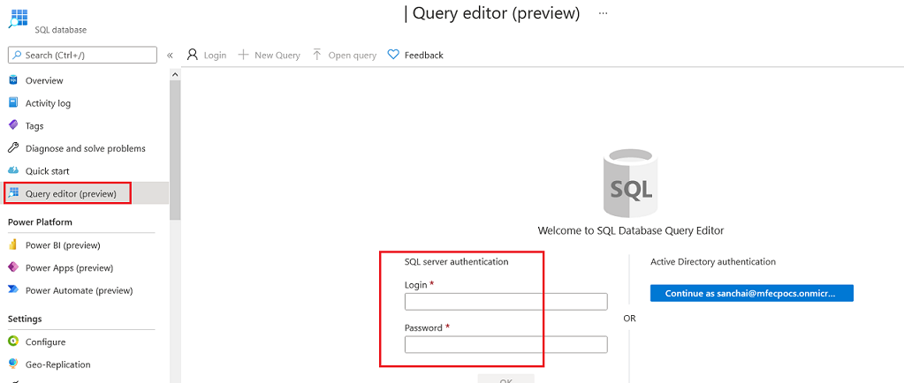
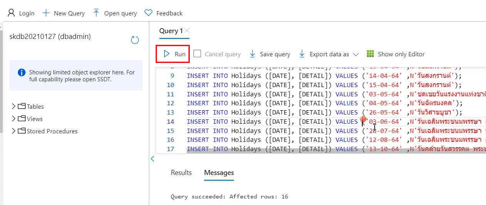
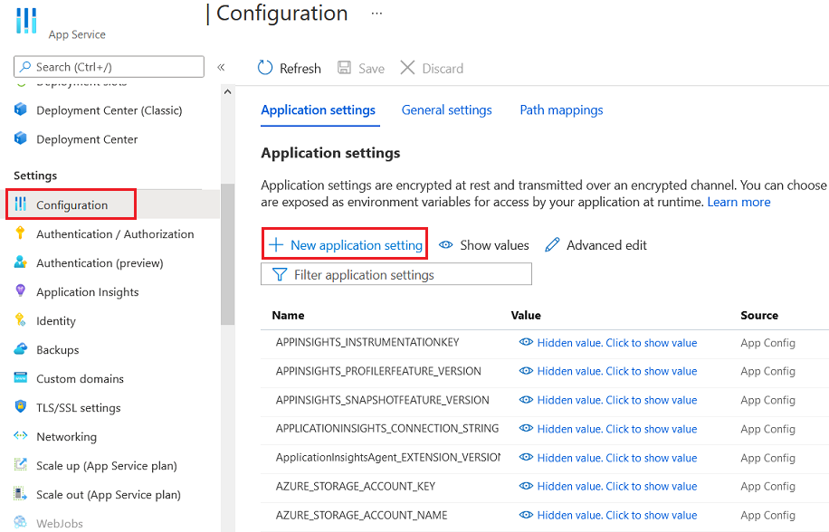

# Create an Azure SQL Database

เริ่มทำารสร้าง Azure SQL Databse โดยเลือกเมนู Create a resource แล้วค้นหา หรือทำการเลือก Azure SQL Database

ที่หน้าจอ Create SQL Database ให้ทำการใส่ค่าตังนี้ 

**Basics Tab**
| | |
|---|---|
| Subscription | (subscription ที่ใช้งานอยู่) |
| Resoure group | (resource group ที่ใช้งานอยู่) |
| Database name | (ชื่อ database) |
| Server | ให้กด link Create new แล้วทำการตั้งค่าสำหรับการสร้าง SQL Server ดังนี้ |

| New Server | |
|---|---|
| Server name | (ตั้งชื่อ database server) |
| Server admin login | (ตั้ง username สำหรับ Admin เพื่อเข้าใช้งาน Database server) |
| Password | (ตั้งรหัสผ่านสำหรับ Admin เพื่อเข้าใช้งาน database server) |
| Confirm password | (ยืนยันรหัสผ่านสำหรับ Admin) |
| Location | (Asia Pacific) Southeast Asia |

| Basics Tab (cont.) | |
|---|---|
| Want to use SQL elastic pool? | No |
| Compute + storage | (กดปุ่ม Configure database เพื่อเลือก ประภเทและ Sizing ของ Database โดยใช้เลือกเป็น **Standard 10 DTU**) | Backup storage redundancy | Locally-redundant backup storage |

**Networking Tab**
| | |
|---|---|
| Allow Azure services and resources to access this server | Yes |

**Additional settings**
| | |
|---|---|
| Use existing data | None |
| Database collation | SQL_Latin1_General_CP1_CI_AS (default) |
| Enable Azure Defender for SQL | Not now |
| Maintenance window | System default |

แล้วกดปุ่ม Review + create และ ยืนยันการสร้าง Azure SQL Database

# Connect and Prepare Data

ไปที่ database ที่ถูกสร้างขึ้น ให้เลือกไปที่ **Query editor (preview)** tab 
ทำการใส่ Username และ Password ของ Admin ที่ตั้งไว้ก่อนหน้า แล้วกดปุ่ม OK เพื่อทำการเชื่อมต่อกับฐานข้อมูล 

ทำการใส่ command ตามด้านล่างใน Query editor และทำการรันเพื่อสร้างตารางและใส่ข้อมูลทดสอบ 

>CREATE TABLE Holidays (
> [DATE] CHAR(10),
> [DETAIL] NVARCHAR(500)
>);\
>INSERT INTO Holidays ([DATE], [DETAIL]) VALUES ('01-01-64' ,N'วันขึ้นปีใหม่');\
>INSERT INTO Holidays ([DATE], [DETAIL]) VALUES ('06-04-64' ,N'วันพระบาทสมเด็จพระพุทธยอดฟ้าจุฬาโลกมหาราช และวันที่ระลึกมหาจ...');\
>INSERT INTO Holidays ([DATE], [DETAIL]) VALUES ('13-04-64' ,N'วันสงกรานต์');\
>INSERT INTO Holidays ([DATE], [DETAIL]) VALUES ('14-04-64' ,N'วันสงกรานต์');\
>INSERT INTO Holidays ([DATE], [DETAIL]) VALUES ('15-04-64' ,N'วันสงกรานต์');\
>INSERT INTO Holidays ([DATE], [DETAIL]) VALUES ('03-05-64' ,N'ชดเชยวันแรงงานแห่งชาติ');\
>INSERT INTO Holidays ([DATE], [DETAIL]) VALUES ('04-05-64' ,N'วันฉัตรมงคล');\
>INSERT INTO Holidays ([DATE], [DETAIL]) VALUES ('26-05-64' ,N'วันวิสาขบูชา');\
>INSERT INTO Holidays ([DATE], [DETAIL]) VALUES ('03-06-64' ,N'วันเฉลิมพระชนมพรรษา สมเด็จพระนางเจ้าสุทิดา พัชรสุธาพิมลลักษณ...');\
>INSERT INTO Holidays ([DATE], [DETAIL]) VALUES ('28-07-64' ,N'วันเฉลิมพระชนมพรรษา พระบาทสมเด็จพระปรเมนทรรามาธิบดีศรีสินทร ...');\
>INSERT INTO Holidays ([DATE], [DETAIL]) VALUES ('12-08-64' ,N'วันเฉลิมพระชนมพรรษา สมเด็จพระนางเจ้าสิริกิติ์ พระบรมราชินีนา...');\
>INSERT INTO Holidays ([DATE], [DETAIL]) VALUES ('13-10-64' ,N'วันคล้ายวันสวรรคต พระบาทสมเด็จพระบรมชนกาธิเบศร มหาภูมิพลอดุล...');\
>INSERT INTO Holidays ([DATE], [DETAIL]) VALUES ('22-10-64' ,N'ชดเชยวันปิยมหาราช');\
>INSERT INTO Holidays ([DATE], [DETAIL]) VALUES ('06-12-64' ,N'ชดเชยวันคล้ายวันพระบรมราชสมภพ พระบาทสมเด็จพระบรมชนกาธิเบศร ...');\
>INSERT INTO Holidays ([DATE], [DETAIL]) VALUES ('10-12-64' ,N'วันรัฐธรรมนูญ');\
>INSERT INTO Holidays ([DATE], [DETAIL]) VALUES ('31-12-64' ,N'วันสิ้นปี');

# Configure App Settings

สำหรับรัน Application แบบ Local ให้ทำการสร้างไฟล์ .env ใน project folder (\Files\03\web) และใส่ค่าดังนี้ 
>MSSQLSERVER=(ชื่อ Server สามารถดูได้จาก Overview Tab ของ Database Server)\
>DBNAME=(ชื่อฐานข้อมูล)\
>DBUSERNAME=(ชื่อเข้าใช้งาน)\
>DBPASSWORD=(รหัสผ่าน)

สำหรับ App Service ให้ไปที่ **Configuration Tab** แล้วทำกดปุ่ม **+New application settings** เพื่อเพิ่มค่า โดยให้เพิ่ม key value แบบเดียวกับไฟล์ .env 

# Update Web application to connect with SQL Database

ให้ทำการ deploy web application ไปที่ App Service โดยใช้ source จาก **web** folder ใน ที่อยู่ภายใต้ **(repo)/Files/03/** 
