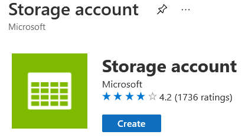
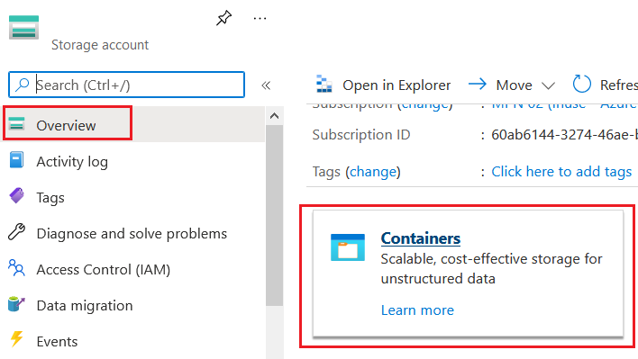
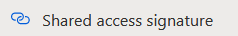

# Create Azure Storage

เลือกเมนู create resource และทำการสร้าง **Storage Account**

และทำการใส่ค่าค่างๆดังนี้ 

**Basics Tab**
| | |
|---|---|
| Subscription | (subscription ที่ใช้งาน) |
| Resource group | (resource group ที่ใช้งาน) |
| Storage account name | (ชื่อ storage account) |
| Location | (Asia Pacific)Southeast Asia |
| Performance | Standard |
| Account kind | StorageV2 (general purpose v2) |
| Replication | Locally-redundant storage (LRS) |

**Networking Tab**
| | |
|---|---|
| Connectivity method | Public endpoint (all networks) |
| Routing preference | Microsoft network routing (default) |

**Data protection Tab** 
- Uncheck All

**Advanced Tab**
| | |
|---|---|
| Secure transfer required | Enabled |
| Allow shared key access | Enabled |
| Minimum TLS version | Version 1.2 |
| Allow Blob public access | Enabled |
| Blob access tier (default) | Hot |
| Data Lake Storage Gen2 | Disabled |
| Large file shares | Disabled |

แล้วกดปุ่ม Review + create และทำการยืนยันการสร้าง Storage Account

# Create Blob Container

ไปที่ Storage Account ที่สร้างขึ้น ที่ **Overview Tab** เลือกเข้าไปใน **Container**

กดปุ่ม **+ Container** เพื่อทำการสร้าง container ใหม่ แล้วใส่ค่าดังนี้

| | | 
|---|---|
| Name | logs |
| Public access level | Private (no anonymous access) |

เสร็จแล้วกดปุ่ม Create เพื่อทำการสร้าง Container

# Create SAS Token

ตามปกติ เราสามารถใช้ storage access key ในการทำงานกับ storage แต่ในบางกรณี เราสามารถสร้าง SAS (Shared Access Signature) เพื่อใช้กับ Stoage โดยสามารถจำกัดสิทธิเพิ่มเติมได้

ไปที่ **Shared access signature** tab ของ Storage Account ที่ถูกสร้างขึ้น 

ให้ระบุค่าในการสร้าง SAS token ดังนี้ 

| | |
|---|---|
| Allowed services | Blob |
| Allowed resource types | Container, Object |
| Allowed permissions | Read, Write, List, Add, Create |
| Start and expiry date/time | เลือกเวลาให้ครอบคลุมช่วงปัจจุบัน |

แล้วกดปุ่ม **Generate SAS and connection string** เพื่อทำการสร้าง SAS Token แล้วให้ทำกาารเก็บค่าที่ได้มาเอาไว้

# Configure App Settings

สำหรับรัน Application แบบ Local ให้ทำการสร้างไฟล์ .env ใน project folder (\Files\04\web) และใส่ค่าดังนี้ 
>MSSQLSERVER=(ชื่อ Server สามารถดูได้จาก Overview Tab ของ Database Server)\
>DBNAME=(ชื่อฐานข้อมูล)\
>DBUSERNAME=(ชื่อเข้าใช้งาน)\
>DBPASSWORD=(รหัสผ่าน)\
>AZURE_STORAGE_ACCOUNT_KEY=(storage account key จาก Access Keys tab ของ storage account)\
>AZURE_STORAGE_ACCOUNT_NAME=(ชื่อ storage account)\
>LOG_BLOB_SAS_URL=(ค่า Blob log container url + SAS Token ที่ได้มาจากขั้นตอนก่อนหน้า)

สำหรับ App Service ให้ไปที่ **Configuration Tab** แล้วทำกดปุ่ม **+New application settings** เพื่อเพิ่มค่า โดยให้เพิ่ม key value แบบเดียวกับไฟล์ .env 

# Update Web application to use Azure Storage

ให้ทำการ deploy web application ไปที่ App Service โดยใช้ source จาก **web** folder ใน ที่อยู่ภายใต้ **(repo)/Files/04/** 