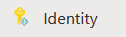
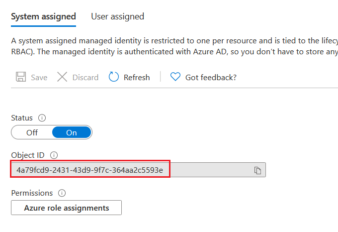
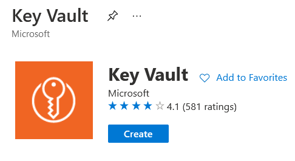
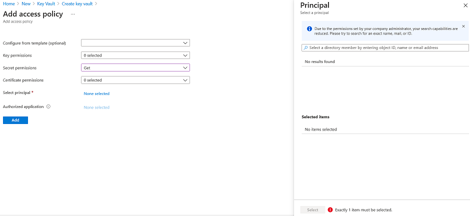
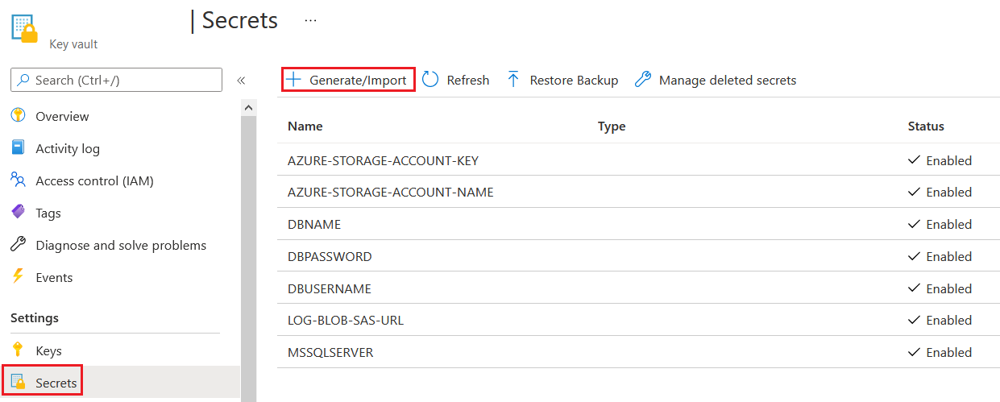

# Enable App Service's Managed Identity

ไปที่ App Service และเลือกไปที่ **Identity** Tab

เลือกไปที่ **System assigned** tab แล้วเปลี่ยน Status เป็น **On**
ทำการ Save ค่า และเก็บค่า Object ID เอาไว้

# Create Key Vaults

ไปที่เมนู Create a resource ค้นหาคำว่า Key Vault เพื่อทำการสร้าง Key Vault

และใส่ค่าต่างๆดังนี้ 

**Basics tab**
| | |
|---|---|
| Subscription | (Subscription ที่ใช้งาน) |
| Resource group | (Resource group ที่ใช้งาน) | 
| Key vault name | ชื่อ Keyvault |
| Region | Southeast Asia |
| Pricing Tier | Standard |
| Days to retain deleted valuts | 90 (default) |
| Purge protection | Disable |

**Access policy tab**
| | |
|---|---|
| Enable Access To | all unchecked |
| Permission model | Vault access policy |

ให้ทำการกดปุ่ม **+ Add Access Policy** เพื่อทำการกำหนดสิทธิในการใช้งาน Key Vault ให้กับ App Service โดยระบุค่าต่างๆดังนี้ 

| | |
|---|---|
| Secret permissions | Get |
| Select principal | ให้ทำการเลือก App Service โดย search จาก object id ของ App Service ที่เก็บไว้ก่อนหน้า |

เสร็จแล้วกดปุ่ม Add เพื่อเพิ่ม Access Policy ให้ Key Vault \
หลังจากนั้น ทำการกดปุ่ม Review + create และยืนยันการสร้าง Key Vault

# Create Secrets

ไปที่ Key Vault ที่สร้างขึ้น แล้วไปที่ **Secrets Tab** แล้วทำการกดปุ่ม **Generate/Import** เพื่อสร้างค่า Secret 

ให้ทำการสร้าง Secret โดยมีชื่อ ตาม App Settings ที่ใช้งานก่อนหน้านี้ โดยให้แทนที่ _ ด้วย - (เช่น AZURE_STORAGE_ACCOUNT_KEY => AZURE-STORAGE-ACCOUNT-KEY) 

# Configure App Settings

สำหรับรัน Application แบบ Local ให้ทำการสร้างไฟล์ .env ใน project folder (\Files\05\web) และใส่ค่าดังนี้ 
>MSSQLSERVER=(ชื่อ Server สามารถดูได้จาก Overview Tab ของ Database Server)\
>DBNAME=(ชื่อฐานข้อมูล)\
>DBUSERNAME=(ชื่อเข้าใช้งาน)\
>DBPASSWORD=(รหัสผ่าน)\
>AZURE_STORAGE_ACCOUNT_KEY=(storage account key จาก Access Keys tab ของ storage account)\
>AZURE_STORAGE_ACCOUNT_NAME=(ชื่อ storage account)\
>LOG_BLOB_SAS_URL=(ค่า Blob log container url + SAS Token ที่ได้มาจากขั้นตอนก่อนหน้า)\
>KEY_VAULT_URL=(url ของ Key vault จาก Overview Tab)

สำหรับ App Service ให้ไปที่ **Configuration Tab** แล้วทำกดปุ่ม **+New application settings** เพื่อเพิ่มค่า โดยให้เพิ่ม key value เข้าไปอีก 2 ตัว ดังนี้
>KEY_VAULT_URL=(url ของ Key vault จาก Overview Tab)\
>NODE_ENV=production

# Update Web application

ให้ทำการ deploy web application ไปที่ App Service โดยใช้ source จาก **web** folder ใน ที่อยู่ภายใต้ **(repo)/Files/05/** 

