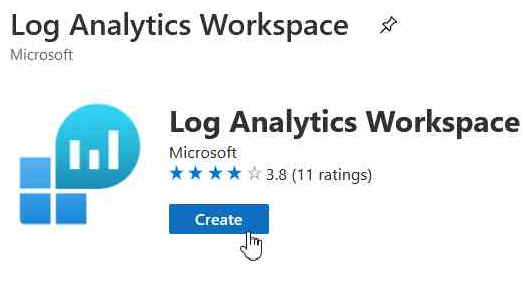
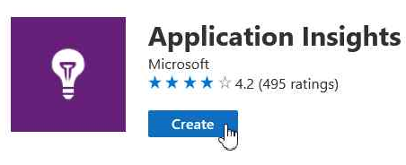
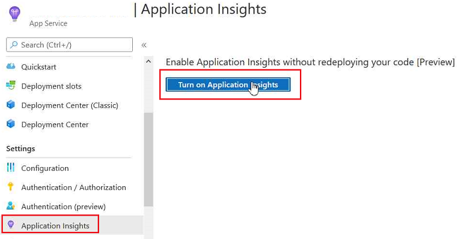

# Create Log Analytics Workspace

สร้าง Log Analytics Workspace 

ทำการใส่ค่าดังนี้ 

**Basics Tab**
| | |
|---|---|
| Subscription | (subscription ที่ใช้งาน) |
| Resource Group | (resource group ที่ใช้งาน) |
| Name | ชื่อ workspace |
| Region | Southeast Asia |

กดปุ่ม Review + create และทำการยืนยันการสร้าง Log Analytics Workspace

# Create Application Insights

สร้าง Application Insights

ทำการใส่ค่าดังนี้ 

**Basics Tab**
| | |
|---|---|
| Subscription | (subscription ที่ใช้งาน) |
| Resource Group | (resource group ที่ใช้งาน) |
| Name | ชื่อ workspace |
| Region | (Asia Pacific)Southeast Asia |
| Resource Mode | Workspace-based |
| Workspace Details-Subscription | (subscription ที่ใช้งานอยู่) |
| Log Analytics Workspace | เลือก Log Analytic Workspace ที่สร้างไว้ก่อนหน้านี้ |

กดปุ่ม Review + create และทำการยืนยันการสร้าง Application Insights

# Configure App Service to use Application Insights

ให้ไปที่ App Service แล้วเลือกไปที่ **Application Insights** Tab แล้วกดปุ่ม Turn on Application Insights

หลังจากนั้น ทำการระบุค่าต่างๆดังนี้ 
- ทำการเลือกตัวเลือก Select existing resource
- เลือกรายการ Application Insights ที่สร้างขึ้นมาก่อนหน้านี้ 
- กดปุ่ม Apply เพื่อบันทึกข้อมูล

เสร็จแล้วให้ลองทำการ Browse Web สักเล็กน้อย แล้วไปดูผลใน Application Insights

# Update Web Application

สำหรับรัน Application แบบ Local ให้ทำการสร้างไฟล์ .env ใน project folder (\Files\06\web) และใส่ค่าดังนี้ 
>MSSQLSERVER=(ชื่อ Server สามารถดูได้จาก Overview Tab ของ Database Server)\
>DBNAME=(ชื่อฐานข้อมูล)\
>DBUSERNAME=(ชื่อเข้าใช้งาน)\
>DBPASSWORD=(รหัสผ่าน)\
>AZURE_STORAGE_ACCOUNT_KEY=(storage account key จาก Access Keys tab ของ storage account)\
>AZURE_STORAGE_ACCOUNT_NAME=(ชื่อ storage account)\
>LOG_BLOB_SAS_URL=(ค่า Blob log container url + SAS Token ที่ได้มาจากขั้นตอนก่อนหน้า)\
>KEY_VAULT_URL=(url ของ Key vault จาก Overview Tab)\
>APPINSIGHTS_INSTRUMENTATIONKEY=(ค่า instrumentationkey จาก Overview Tab ของ Application Insight)

*สำหรับ App Service ค่า AppSettings ของ Application Insights จะถูกเพิ่มให้อัตโนมัติแล้วจากตอน Enable Application Insights ก่อนหน้านี้

ให้ทำการ deploy web application ไปที่ App Service โดยใช้ source จาก **web** folder ใน ที่อยู่ภายใต้ **(repo)/Files/06/** 

# SDK link
https://github.com/Microsoft/ApplicationInsights-node.js/
