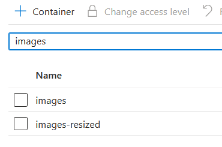
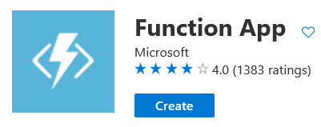
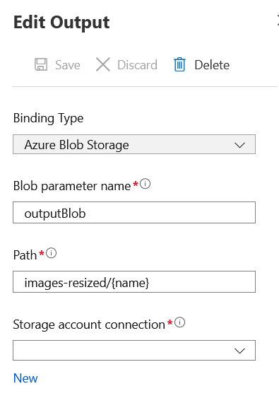
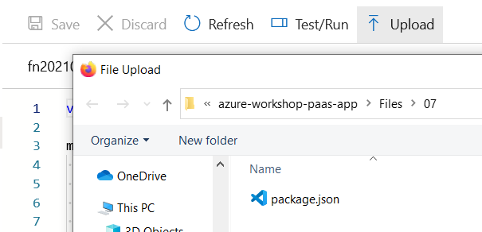
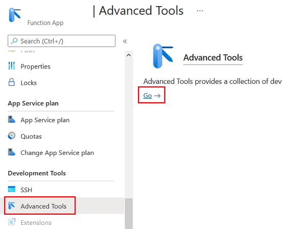
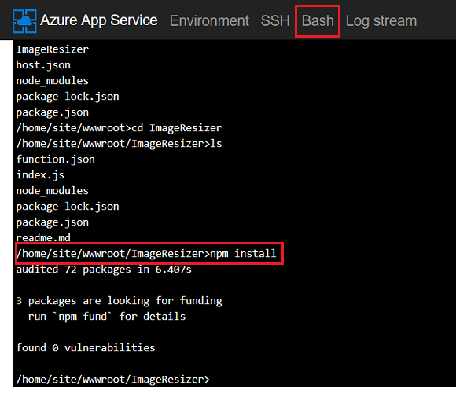

# Create Blob Containers

ไปที่ Storage Account ให้ทำการสร้าง Blob Container เพิ่ม 2 ตัว ชื่อ **images** และ **images-resized**

# Create Azure Function

ทำการ Create Function App 

ระบุค่าต่างๆดังนี้ 

**Basics tab**
| | |
|---|---|
| Subscription | (subscription ที่ใช้งาน) |
| Resource Group | (resource group ที่ใช้งาน) |
| Function App name | ชื่อ Function App |
| Publish | Code |
| Runtime stack | Node.js |
| Version | 12 LTS |
| Region | Southeast Asia |

**Hosting tab**
| | |
|---|---|
| Storage account | ให้เลือก Storage Account ที่สร้างไว้ |
| Operating system | Linux |
| Plan type | App service plan |
| Plan | ให้เลือก App Service Plan ที่สร้างไว้ |

กด Review + create และยืนยันการสร้าง Function App

# Create Blob Trigger Function

ที่ Function App ที่สร้างขึ้น ให้เลือก **Functions tab**

ทำการ Add function กำหนดค่าดังนี้
| | |
|---|---|
| Development environment | Develop in portal |
| Template | Azure Blob Storage trigger |
| New Function | ImageResizer |
| Path | images/{name} |
| Storage account connection | ให้เลือกไปที่ storage account ที่สร้างขึ้นก่อนหน้า หรือถ้ายังไม่มีในตัวเลือกให้กด new เพื่อสร้าง Storage account connection |

เสร็จแล้วกดปุ่ม Add\

ทำการเลือกไปที่ Function ที่เพิ่งสร้างขึ้น แล้วเลือก **Integration Tab**

ที่ส่วน Outputs เลือก **+Add output** แล้วทำการกำหนดค่าดังนี้ 

| | |
|---|---|
| Blob parameter name | outputBlob |
| Path | images-resized/{name} |
| Storage account connection | ให้เลือกไปที่ storage account ที่สร้างขึ้นก่อนหน้า |

เสร็จแล้วให้ทำการบันทึกข้อมูล

กลับไปที่ Function ที่สร้างขึ้น แล้วเลือก **Code + Test Tab**

กดปุ่ม Upload แล้วทำการ Upload file \Files\07\package.json

Update Function Script ตามด้านล่างแล้วกดปุ่ม Save

>var Jimp = require("jimp");\
>\
>module.exports = function(context, myBlob) {\
>&nbsp;&nbsp;&nbsp;&nbsp;Jimp.read(myBlob, function(err, image) {\
>&nbsp;&nbsp;&nbsp;&nbsp;&nbsp;&nbsp;&nbsp;&nbsp;image.scale(0.5);\
>&nbsp;&nbsp;&nbsp;&nbsp;&nbsp;&nbsp;&nbsp;&nbsp;image.getBuffer(Jimp.AUTO, function(error, imageData) {\
>&nbsp;&nbsp;&nbsp;&nbsp;&nbsp;&nbsp;&nbsp;&nbsp;&nbsp;&nbsp;&nbsp;&nbsp;context.log('Node.JS blob trigger function resized ' + context.bindingData.name + ' to ' + image.bitmap.width + 'x' + image.bitmap.height);\
>&nbsp;&nbsp;&nbsp;&nbsp;&nbsp;&nbsp;&nbsp;&nbsp;&nbsp;&nbsp;&nbsp;&nbsp;context.bindings.outputBlob = imageData;\
>&nbsp;&nbsp;&nbsp;&nbsp;&nbsp;&nbsp;&nbsp;&nbsp;&nbsp;&nbsp;&nbsp;&nbsp;context.done();\
>&nbsp;&nbsp;&nbsp;&nbsp;&nbsp;&nbsp;&nbsp;&nbsp;});\
>&nbsp;&nbsp;&nbsp;&nbsp;});\
>};

เลือกไปที่ Function App เลือก Advanced Tools Tab แล้วกด link Go

เลือกเมนู Bash แล้วเข้าไปที่ folder ของ function ที่มีไฟล์ package.json อยู่ (/home/site/wwwroot/ImageResizer) แล้วรันคำสั่ง npm install

เสร็จแล้วให้ทำการลอง Upload รูปเข้าไปใน images container ดู function ควรจะทำการ resize รูปและเก็บผลลัพท์ให้ใน images-resized โดยอัตโนมัติ

# Create HTTP Trigger Function

ที่ Function App ที่สร้างขึ้น ให้เลือก **Functions tab**

ทำการ Add function กำหนดค่าดังนี้
| | |
|---|---|
| Development environment | Develop in portal |
| Template | Azure Blob Storage trigger |
| New Function | ชื่อ function |
| Authorization level | Function |

เสร็จแล้วให้ลองรันทดสอบดูความแตกต่าง

# Logic App Introduction